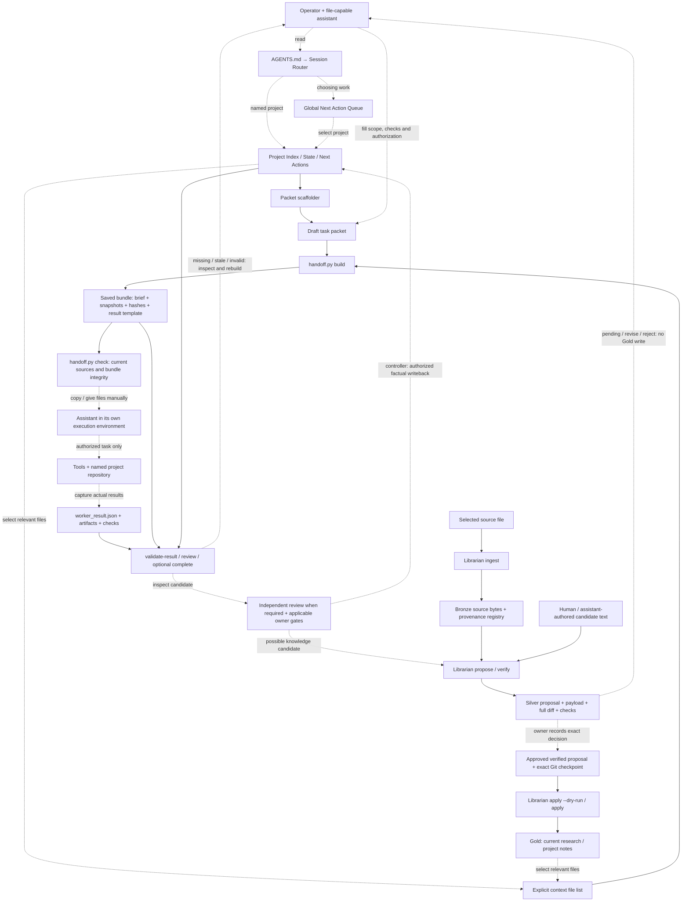
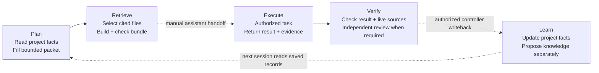

# AEOS — architecture and usage

AEOS coordinates project knowledge, bounded context, work, evidence and controlled knowledge updates through saved files and local commands. An operator and assistant follow the documented workflow; the preview does not install an autonomous execution service.

This page describes the public setup package, not the creator's personal operating vault. File links below target the current candidate [public.2 package](README.md). Historical public.1 remains a separate, frozen revision.

## How the components connect

Solid arrows represent a file input/output or check implemented by a CLI. Dashed arrows represent an operator/assistant action. Neither style implies a background integration.



Project writeback and Librarian Gold application are different operations. `proposed_writeback` in a worker result is a suggestion; the handoff adapter never applies it. Librarian verification never supplies owner approval. A passed structural check is not independent review or permission to execute.

## Component contracts

Paths are relative to the package's `vault/`, except package scripts and adapter configuration.

| Component | What goes in → what comes out | How it is used / current status |
|---|---|---|
| [Router](vault/00_SYSTEM/SESSION_START_ROUTER.md) | Named task or broad intent → minimum records to read | **Manual / assistant-invoked:** read `AGENTS.md`, then the router. It is Markdown guidance, not a routing process. |
| [Queue](vault/00_SYSTEM/GLOBAL_NEXT_ACTION_QUEUE.md) and [project records](vault/01_PROJECTS/Sample/PROJECT_INDEX.md) | Priority, scope, state, locks and next actions → selected work and current facts | **Manual:** use the queue to choose among projects; for a named project, read its Index, State and Next Actions directly. No mandatory dashboard hop. |
| Vault / knowledge notes | Source evidence and reviewed facts → selected context files | **Manual retrieval:** read relevant files and cite their provenance. The preview ships no Wiki search service, vector database or automatic ingestion from URLs. |
| [Packet scaffolder](vault/09_TOOLS/agent_runner_v1/scripts/build_task_packet.py) | Project records + goal → draft `task_packet.md` | **CLI:** `build_task_packet.py`. Operator fills allowed reads/writes, acceptance checks and actual authorization. A draft is not approval. |
| [Handoff adapter](vault/09_TOOLS/agent_runner_v1/unified_handoff/handoff.py) | Packet + explicit `--read` selections → bounded copied brief, snapshots, manifest and result template | **CLI:** `build`, `check`, `validate-result`, `review`; `complete` also checks actual scoped changes and rationale. The bundle lives outside the source vault. |
| [Assistant adapters](config/adapters.json) | Reviewed bundle → actual task result and evidence | **Manual transport:** hand the selected files to your assistant and bring its result back. Configuration describes transports; it does not authenticate providers, launch Codex/Astra or confer permissions. |
| Verification / continuity | Source hashes, returned result and artifact hashes → candidate validity, current/stale/missing observations and next action | **CLI + human review:** `check` before handoff; `validate-result` and `review` after return. Independent review and owner gates are separate. Fresh sessions read saved files and rerun `review`. |
| [Librarian](vault/00_SYSTEM/AGENTIC_LIBRARIAN/README.md) | Source bytes + provenance + authored candidate → Bronze, pending Silver, then conditionally Gold | **CLI:** `ingest`, `propose`, `verify`, `inbox`, `apply`, `doctor`, `rollback`. Gold requires an exact owner decision, fresh verified evidence and a covered clean Git checkpoint. The demo stops at pending Silver. |
| [Kernel ledger](vault/kernel/artifact_ledger.py) | Librarian events → local evidence records | **Invoked by Librarian:** records events; it is not an execution scheduler or a tamper-proof audit service. |
| [Package checker / demo](scripts/demo.py) | Manifested package + synthetic source → demonstration result, saved commands and continuation files | **CLI:** explicit first-run action. Deterministic Python performs the example; no model, independent reviewer or owner approval is simulated. |

## Plan → Retrieve → Execute → Verify → Learn



To try the implemented flow, follow [FIRST_RUN.md](FIRST_RUN.md). After installing its prerequisites, from a fresh extraction:

```powershell
python -B scripts/check_package.py .
python -B scripts/demo.py --output ../aeos-first-run
```

Open `../aeos-first-run/START_HERE.md`. The demo ingests a synthetic source, verifies a pending Silver proposal, selects that evidence into a handoff, counts two checked items and saves a candidate result. It then demonstrates refusal of changed and missing sources and restores the synthetic fixture. From the output directory, a fresh process can recover the same candidate:

```powershell
python -B vault/09_TOOLS/agent_runner_v1/unified_handoff/handoff.py review --bundle handoff --vault-root vault
```

For real work, scaffold a packet in your own new vault using the first-run instructions. Give only the approved packet and selected context to an assistant. Return `worker_result.json` and its artifacts, run the documented checks, obtain required independent review and perform only authorized writeback. Contradictory facts require operator reconciliation; a script does not decide which claim is true. Missing evidence stays unknown; stale hashes require inspection and a new authorized bundle, not edited hashes.

## Influences and limits

**ICM** means Interpretable Context Methodology in the recorded [source credits](SOURCES.md). It informs layered files and selective context. It is not a separate runtime between retrieval and execution. Karpathy's **LLM Wiki** informs source-backed notes and compiled knowledge; the local Librarian implements the explicit Bronze/Silver/owner/Gold workflow. It does not install Karpathy's gist or a Wiki connector.

The public preview includes a queue and project templates, but no Operator Dashboard application, MAPS view, general Resume/Restore engine, native sandbox, hosted service, automatic model dispatch or authenticated owner-approval service. Do not infer those features from the creator's personal OS or a conceptual diagram. Refer to the [security repair evidence](SECURITY-REPAIRS.md) for the current candidate's checks and remaining limits; historical acceptance and an archive's existence are not proof a future installation is safe.
